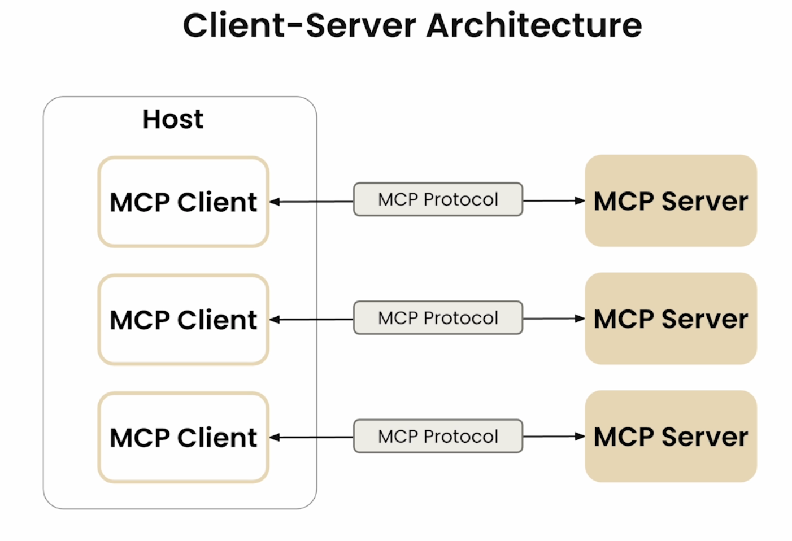
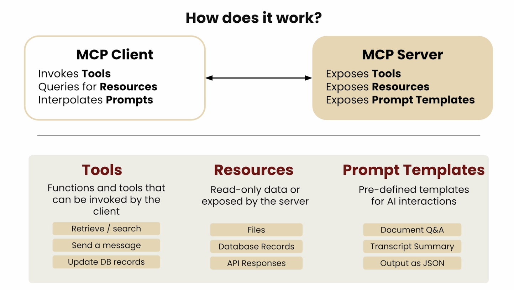
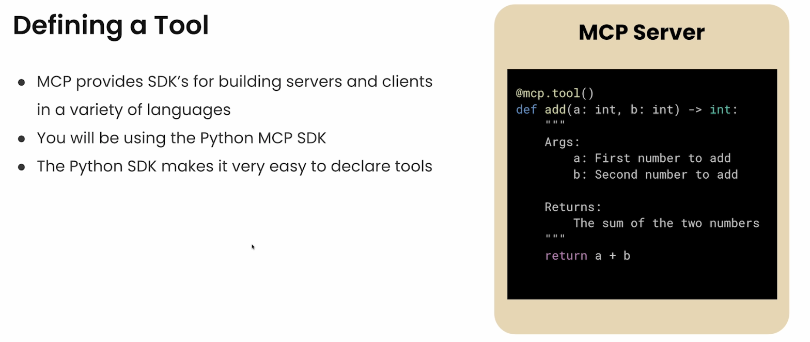
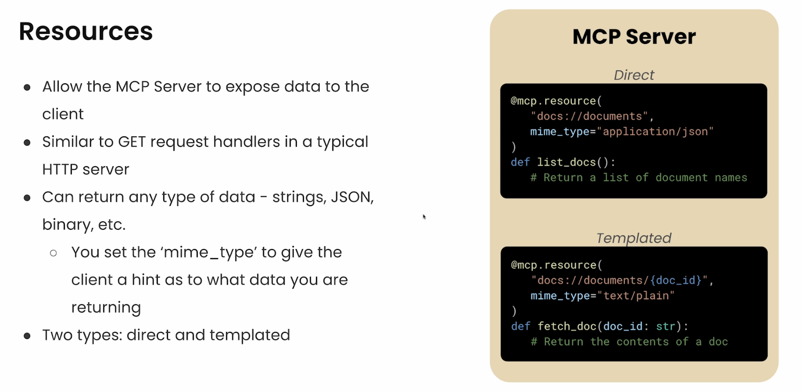
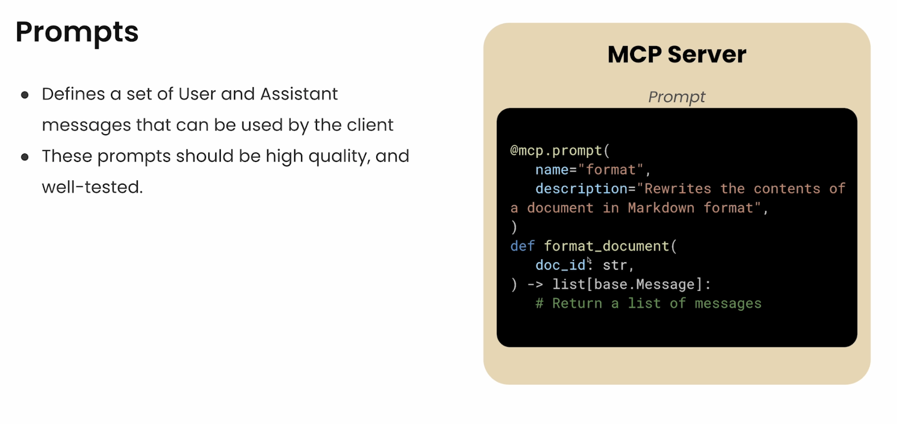
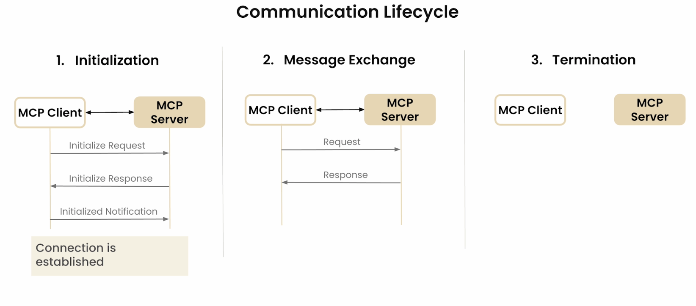

# MCP 教程：从架构到实践

## 一、MCP 架构简介

本章节将深入探讨 MCP（Model Context Protocol）的架构及其背后的工作原理。MCP 是基于客户端-服务器 (Client-Server) 架构设计的，适合构建 AI 应用并连接外部数据源。

### 1.1 客户端 (Client) 与服务器 (Server)

MCP的架构图如下：

详细解释如下：
- 客户端 (Client)：MCP 客户端与 MCP 服务器保持一对一的连接。它们之间的通信通过 MCP 协议定义的消息进行。
- 服务器 (Server)：服务器是轻量级程序，通过协议暴露特定功能。这些功能可以包括数据检索、搜索、消息发送等。
- 主机 (Host)：主机是包含多个客户端的 LLM 应用，负责存储和维护所有客户端以及与 MCP 服务器的连接。比如Claude Desktop、Cursor 或 Windsurf 等工具。

## 二、MCP 协议的基本组件

在深入探讨客户端和服务器的职责之前，我们先来了解一下 MCP 协议的一些基本组件。
下图展示了MCP协议的整个workflow：

包含以下三个主要的组件：

### 2.1 工具（Tools）

工具是客户端可以调用的函数。它们允许检索、搜索、发送消息和更新数据库记录等操作。工具通常用于需要类似 POST 请求或某种修改的数据。

### 2.2 资源（Resources）

资源类似于 GET 请求，是服务器暴露的只读数据或上下文。应用可以选择是否使用这些资源，但不一定需要将其带入上下文。示例包括数据库记录、API 响应、文件、PDF 等。

### 2.3 提示模板（Prompt Templates）

提示模板旨在减轻用户的提示工程负担。它们是预定义的模板，位于服务器上，客户端可以根据需要访问并呈现给用户。用户无需自己编写复杂的提示，只需选择动态数据即可。

## 三、创建 MCP 服务器和客户端

现在，我们已经了解了 MCP 的基本概念和实际应用，接下来介绍如何使用Python创建这些组件。

MCP 提供了用于构建服务器和客户端的软件开发工具包（SDK），支持多种语言。在本课程中，我们将使用 Python MCP SDK。

### 3.1 声明工具 (Tools)

我们通过装饰函数来声明工具，并传递必要的参数和返回值。当工具需要执行时，返回相应的操作。

### 3.2 声明资源 (Resources)

服务器通过指定 URL 或位置来暴露数据给客户端。我们可以装饰一个函数，当资源被访问时返回所需的数据。

### 3.3 声明提示模板 (Prompt Templates)

与声明工具和资源类似，我们通过装饰函数来声明提示模板。我们为提示模板提供名称、描述以及一系列用户或助手消息。

## 四、客户端与服务器之间的通信

### 4.1 通信过程

下图展示了MCP通信过程的详细流程：

1. 初始化过程：当客户端打开与服务器的连接时，会进行初始化过程，包括发送请求、接收响应和确认初始化的通知。

2. 消息交换：初始化完成后，客户端和服务器之间会交换消息。客户端可以向服务器发送请求，服务器也可以向客户端发送请求或通知。

3. 连接终止：通信结束后，连接会被终止。

### 4.2 传输机制 (Transport Mechanisms)

传输机制处理客户端和服务器之间消息发送和接收的细节。
根据应用运行的方式，可以选择不同的传输机制，如标准输入输出（适用于本地服务器）、HTTP 和服务器发送事件（适用于远程服务器）或流式 HTTP（支持有状态和无状态连接）。

详细解释如下：

1. 标准输入输出 (stdio)：适用于本地服务器，客户端将服务器作为子进程启动，并通过标准输入输出进行通信。
2. HTTP 和服务器发送事件 (Server-Sent Events, SSE)：适用于远程服务器，支持有状态连接，服务器可以发送事件和消息回客户端。
3. 流式 HTTP (Streamable HTTP)：支持有状态和无状态连接，使用 HTTP GET 和 POST 请求进行通信。

## 五、总结与展望

在本节课中，我们深入了解了 MCP 的架构、基本组件、实际应用以及如何创建 MCP 服务器和客户端。我们还探讨了客户端与服务器之间的通信和传输机制。

### 5.1 回顾

1. MCP 基于客户端 (Client)-服务器 (Server) 架构，支持 AI 应用连接外部数据源。
2. 工具 (Tools)、资源 (Resources) 和提示模板 (Prompt Templates) 是 MCP 协议的基本组件，使得其与外部数据的交互更加高效。
3. 客户端和服务器之间的通信通过消息交换进行，支持多种传输机制，包括标准输入输出 (stdio)、HTTP SSE 以及 Streamable HTTP。

### 5.2 展望
在之后的章节，我们将通过实际代码来进一步探索 MCP 的功能，并开始构建我们自己的服务器、客户端和主机。通过 MCP，我们可以创建功能强大的应用，将外部数据和系统集成到 AI 应用中。
